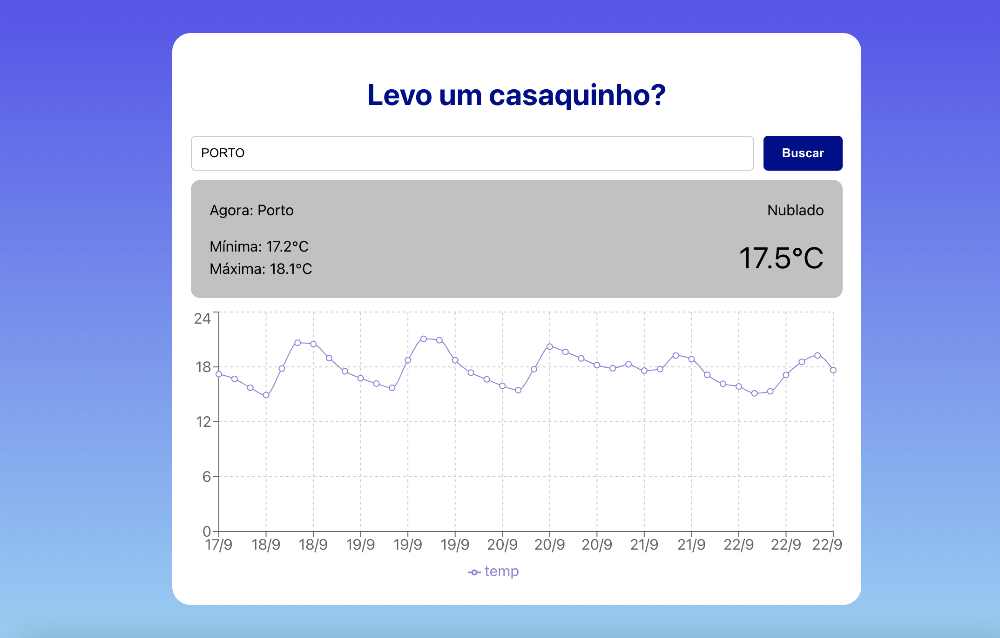

<h1 align="center">Weather Forecast</h1>

  

 ## 📝 About
An application for tracking weather forecasts by city.

## 💻 &nbsp;How to Use

- Clone the repository to your machine:
    - git clone https://github.com/seu-usuario/desafio-tecnico-front-driven.git
    - cd desafio-tecnico-front-driven

- Install project dependencies:
    - npm install

- Run the project:
    - npm run dev

    Access the project in your browser at http://localhost:3000.

## 🛠 &nbsp;Tecnologies

  
  
  
       
  
                                     

## 🚀 &nbsp;Links

- [Deploy](https://desafio-tecnico-front-driven.vercel.app/). 

## 💬 &nbsp;Contact

Made by [Raissa Curty](https://github.com/curtyraissa)!

&nbsp;